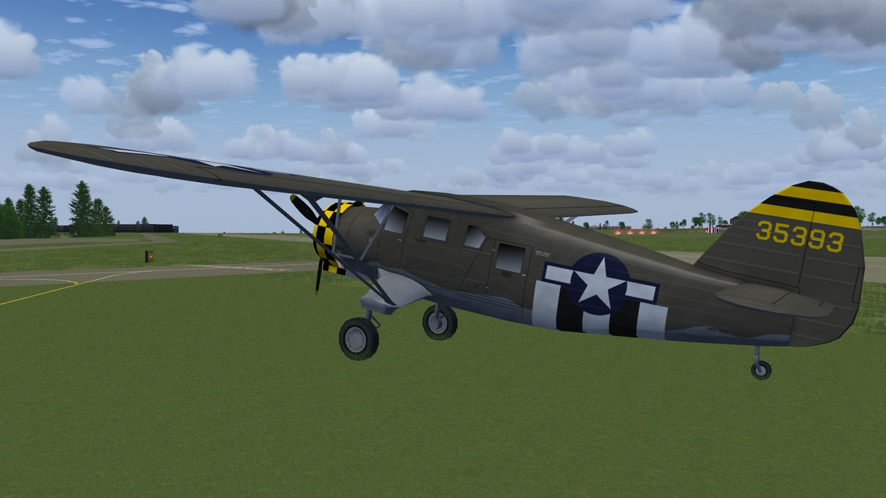
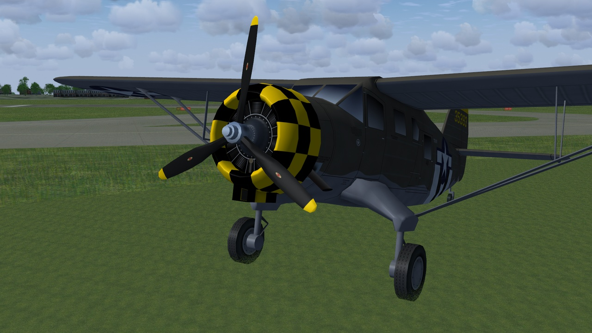
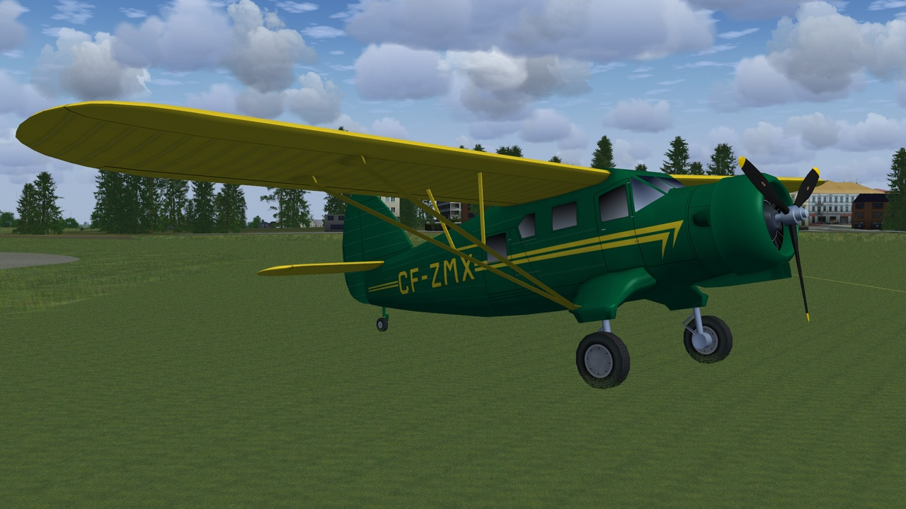
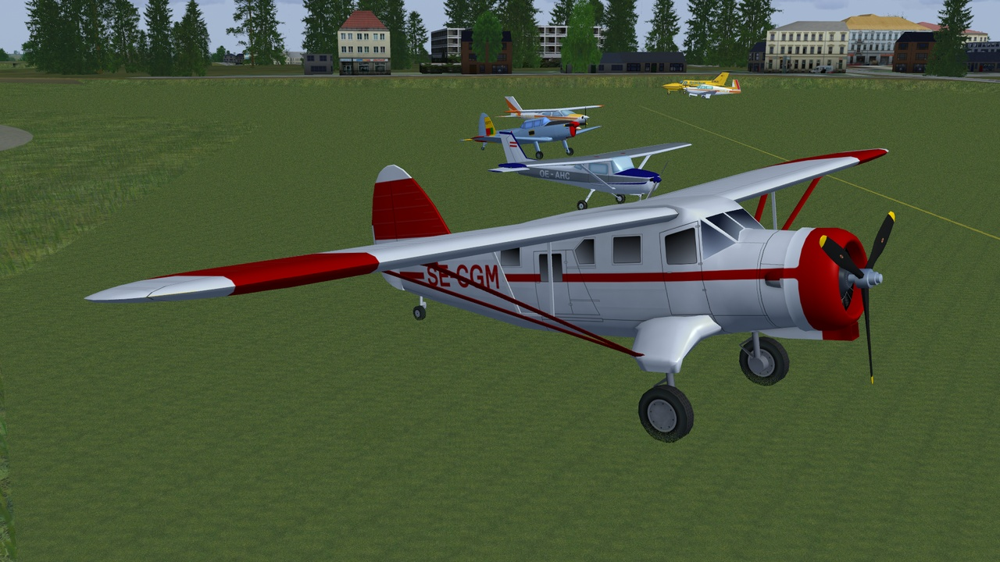
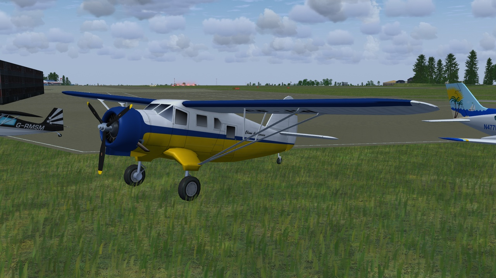
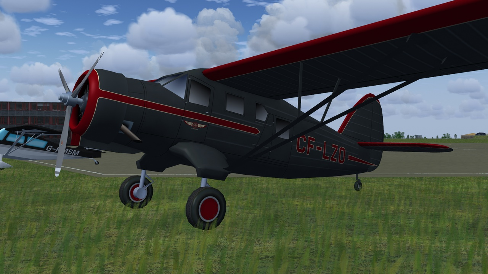
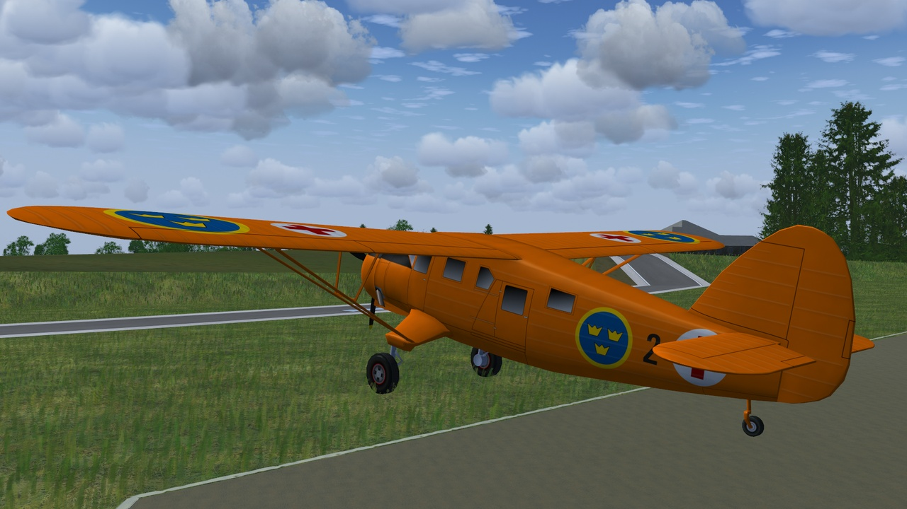
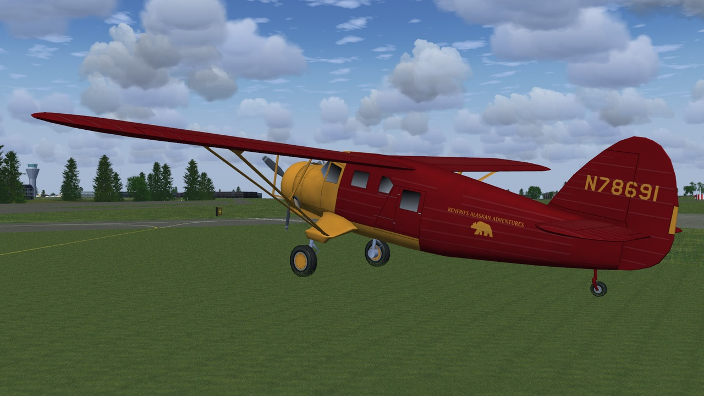
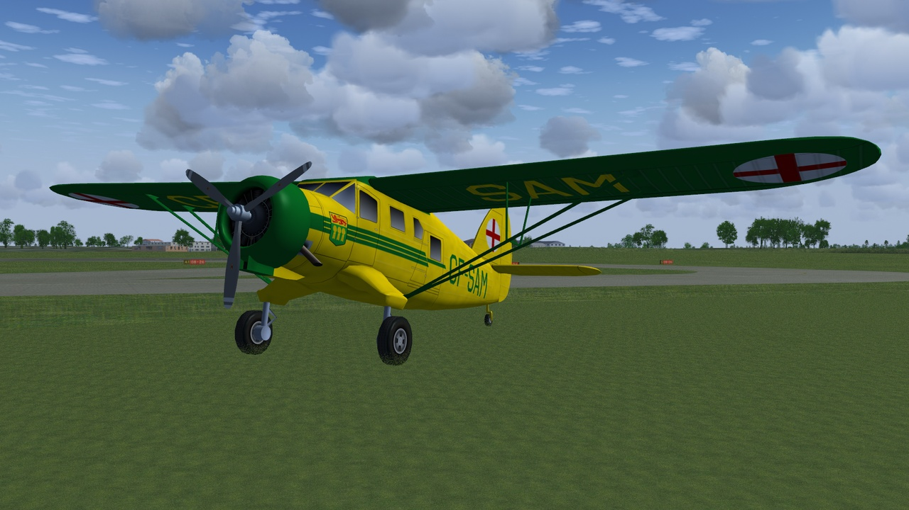
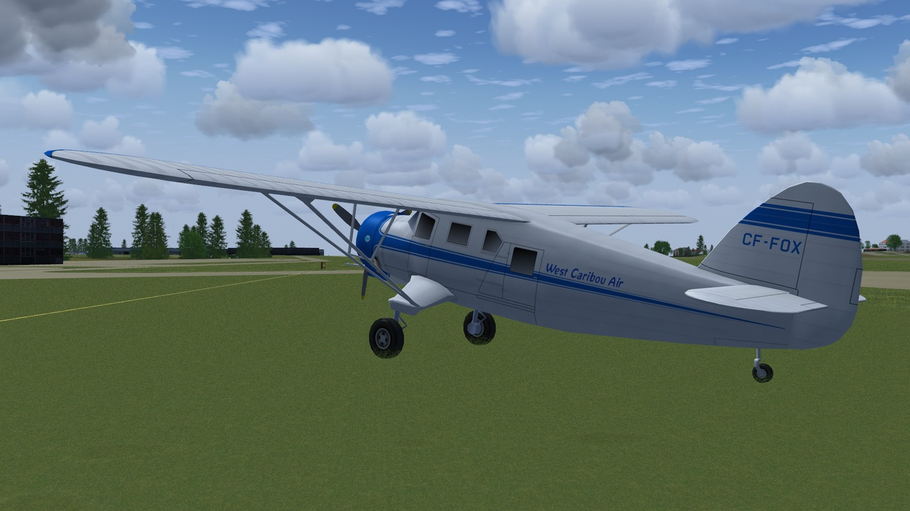

# Noorduyn Norseman
### AI Aircraft for FlightGear
**Work in progress.**

norseman-35393

norseman-CF-ZMX

norseman-SE-CGM

norseman-CF-JIN

norseman-CF-LZO

norseman-Sweden

norseman-N78691

norseman-CF-SAM

norseman-CF-FOX

Download the zip file and extract the "Norseman" folder into the "$FG_ROOT/AI/Aircraft" folder.

To use you will need to create a traffic file, see the wiki for instructions.
 http://wiki.flightgear.org/AI_Traffic

A simple AI Traffic Creator (Python and a 64 bit windows) is available here: 
https://github.com/gooneybird47/FlightGear-AI-Traffic-Creator